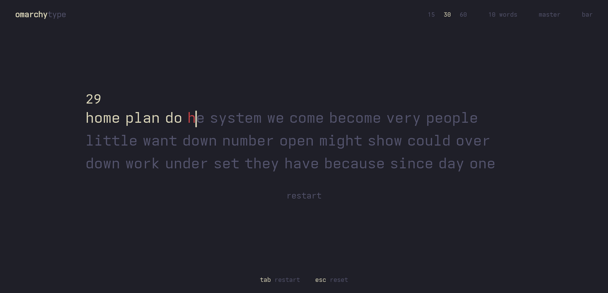
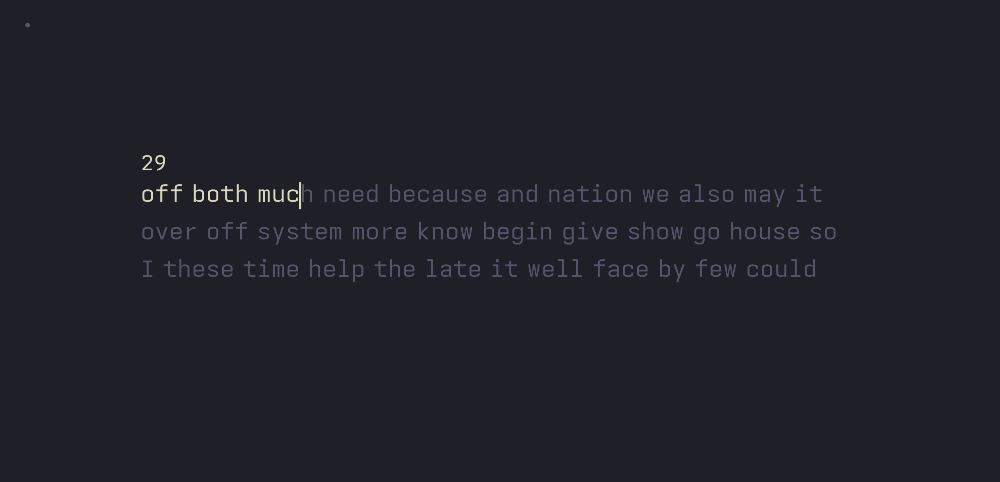
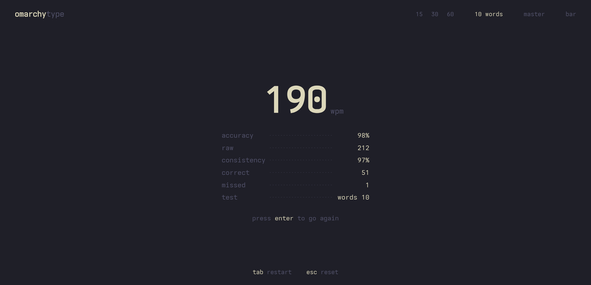

# omarchy-type

A Monkeytype-style typing test that wears your [Omarchy](https://omarchy.org)
theme — and recolours the instant you change it, mid-test, without a reload.



One HTML file, one word list, a ~150-line Python server. No build step, no
`node_modules`, no bundler, no backend. Total size ~80 KB.

```bash
git clone https://github.com/jamesd7788/omarchy-type
cd omarchy-type
./install
omarchy-type
```

The only requirement is **python3** (standard library only). Everything
else is optional.

---

## Modes

| | |
|---|---|
| `15` `30` `60` | timed tests, words keep coming |
| `10 words` | fixed-length test |
| `master` | **any** mistake ends the run immediately |
| `caret` | cycles the caret: bar / underscore |

`master` composes with the others — `60` + `master` is a sixty-second run
where one wrong key ends it. A failed master run reports the speed you
reached and nothing else.

A words test ends the moment its last letter is correct. No trailing space
needed to commit it.

### Keys

| | |
|---|---|
| `tab` | restart |
| `enter` | go again, from the results screen |
| `esc` | reset |
| `backspace` | fix a character |
| `ctrl`+`backspace` | clear the current word |

### Zen mode

Click the logo and everything except the test fades to a single dot. Click
the dot to bring it back. The choice persists.



---

## How the theming works

Omarchy publishes the active theme's palette as a flat TOML file:

```
~/.local/state/omarchy/current/theme/colors.toml
```

Its keys are semantic rather than ANSI slots, which maps onto a typing test
almost directly:

| omarchy | | used for |
|---|---|---|
| `background` | `--bg` | the page |
| `bright_foreground` | `--text` | correctly typed |
| `muted` | `--sub` | not yet typed |
| `accent` | `--accent` | caret, timer, wpm |
| `red` | `--error` | mistakes |

Light themes (`mode = "light"`) work too — the raised-surface colour is
derived in the opposite direction so nothing washes out.

A `theme-set.d` hook fires on every theme change and the server pushes the
new palette to open tabs over SSE:

```
omarchy theme set gruvbox
  → ~/.config/omarchy/hooks/theme-set.d/omarchy-type-theme-hook
  → ~/.local/state/omarchy-type/theme-stamp     (a debounced stamp file)
  → server notices, re-reads colors.toml
  → browser recolours, mid-word
```

The font follows `fc-match monospace` — the same source `omarchy font
current` uses — so the test matches your terminal with no configuration.

### The bundled theme: salt-vault

The `theme` pill in the header pins **salt-vault** — black glass, legal-pad
acid, warm bone text — the palette my tmux statusline and herdr panes both
wear. Click it again to go back to following the desktop.

| | |
|---|---|
| `#08090b` | the page |
| `#e8e0cf` | correctly typed |
| `#68717d` | not yet typed |
| `#d7ff72` | caret, timer, wpm |
| `#ff5f57` | mistakes |

Pinning it outranks the desktop: `omarchy theme set` still streams in and is
remembered, but it won't repaint until you switch back. The choice persists
in `localStorage` alongside the other settings, and is read before the first
paint so there's no flash of the wrong palette on load.

### Off Omarchy

It runs anywhere python3 does. Without Omarchy it simply keeps its built-in
palette, and `./install` skips the hook. To theme it anyway, point it at any
compatible `colors.toml`:

```bash
OMARCHY_TYPE_THEME=~/my-theme/colors.toml omarchy-type
```

---

## Installing it as an app

The page ships a web manifest and a service worker, so any Chromium-based
browser will offer to install it — it then opens in its own window, with no
URL bar, and the OS window chrome follows the painted background.

```
manifest.webmanifest   name, colours, icons
icon.svg               the brand mark
sw.js                  precache + offline
```

Two rules keep the worker from fighting the live-theme design:

- **`/theme` and `/theme/stream` are never cached.** They are live desktop
  state, and the SSE stream must not be buffered, so both bypass the worker
  entirely.
- **Navigations are network-first.** The server deliberately sends
  `no-store` because the page is edited in place; a cache-first worker would
  reintroduce exactly the stale-UI bug that header exists to prevent. The
  cache is the offline fallback, not the fast path.

Offline, the app runs on its precached word list and whichever palette you
last used. Bump `VERSION` in `sw.js` to retire an old cache.

---

## Scoring

WPM, accuracy and consistency are computed the way Monkeytype computes
them — transcribed from its source and checked against it:

| | |
|---|---|
| wpm | `correctWord / 5 / (seconds / 60)` |
| raw | `(allCorrect + incorrect + extra) / 5 / (seconds / 60)` |
| accuracy | correct keystrokes ÷ all keystrokes |
| consistency | `kogasa(stdDev / mean)` over per-second raw wpm |

The subtlety worth knowing: **a word containing any wrong character
contributes zero to WPM**, including the letters you got right. That is why
one typo costs far more than the accuracy figure suggests.

`kogasa` maps the coefficient of variation onto `[100, 0)` with a sigmoid
rather than a straight line, which is why mid-range consistency scores land
lower than you'd expect:

```js
100 * (1 - Math.tanh(cov + cov**3 / 3 + cov**5 / 5))
```



---

## Layout

```
index.html                    the whole app — markup, styles, logic
words/english.json            Monkeytype's english word list
install                       links the launcher, registers the hook
bin/omarchy-type              launcher (starts the server if needed)
bin/serve                     static server + /theme and /theme/stream (SSE)
bin/theme-json                colors.toml → JSON
bin/omarchy-type-theme-hook   copied into theme-set.d
test/                         headless-Chromium checks
```

`OMARCHY_TYPE_PORT` moves it off the default port (8421).
`omarchy-type --stop` shuts the server down; `--serve-only` just prints the
URL.

---

## Notes for hacking on it

Two things caused every layout bug in this project, so they are worth
stating plainly.

**Line height is derived, never set independently.** `--line-h` is always
`1.5 × --word-size`. Every caret offset is measured from the resulting line
box, so a media query that changed the font size alone silently desynced the
ratio and put the caret in the wrong place at that width.

**Caret geometry is measured, not guessed.** The bar and underscore are
positioned from the font's real metrics — read via canvas `TextMetrics` and
published as CSS variables:

```
--cap-top   top of the ink        --base-y  the baseline
--ink       ink band height       --char-w  one character cell
```

The line box carries more leading below the glyphs than above, so centring
on the *box* hangs the caret low; and `1ch` resolves against the root font
size, not the word size, so it makes the underscore about half a cell wide.
Both were real bugs here.

The type is a **fixed size at every viewport width** — a narrow window fits
fewer words per line and rewraps. It does not shrink.

### Tests

```bash
test/run                 everything
test/run width-sweep     just one check
```

They drive a real headless Chromium over the DevTools protocol and type
with genuine key events. `test/run` starts the app and the browser, runs
the checks, and cleans up after itself.

**No dependencies** — `test/cdp.js` speaks just enough of the WebSocket
protocol to talk to Chromium, so the suite runs from a fresh clone with
nothing installed but node and a chromium.

| | |
|---|---|
| `width-sweep.js` | font size, line ratio, caret alignment and line count across nine widths |
| `wrap-caret.js` | the caret tracks the active word across wrapped lines, and follows a mid-test resize |

---

## Licence

GPL-3.0, because `words/english.json` is vendored from
[Monkeytype](https://github.com/monkeytypegame/monkeytype), which is
GPL-3.0. Everything else here was written from scratch — this is not a fork
of Monkeytype and shares none of its code.
